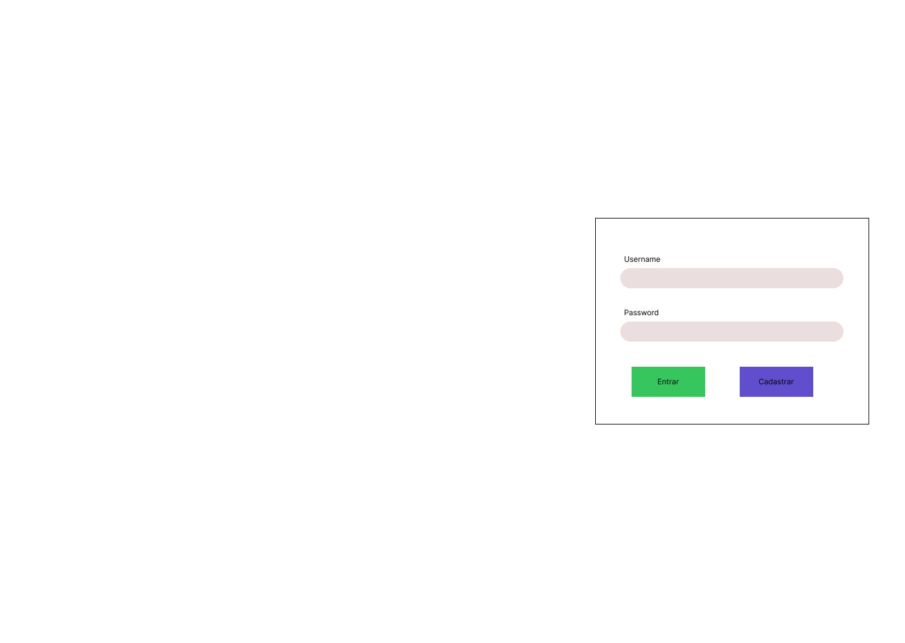
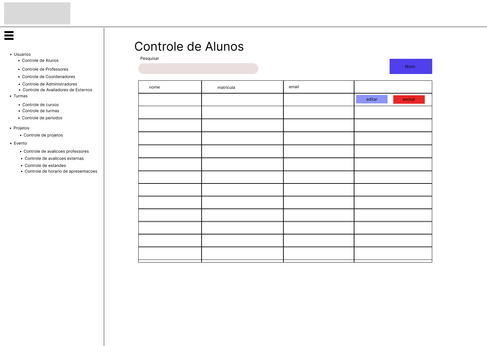
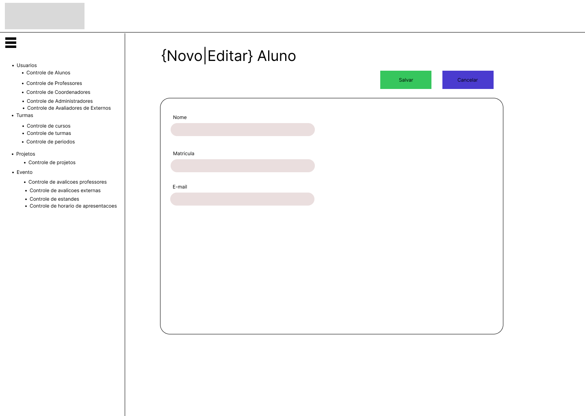
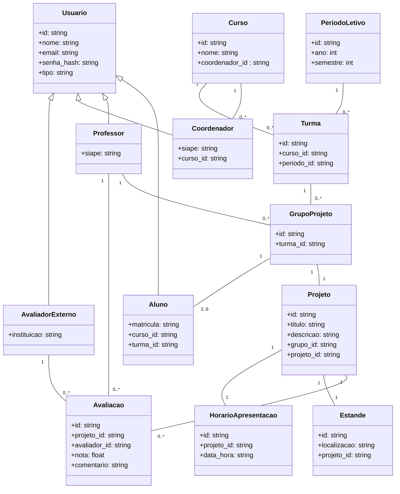

"# front20251-produto1" 







# Comando para iniciar a branch do meu controle

``` bash
git clone https://github.com/ProjetoProfJames/front20251-produto1.git
git checkout -b grupo_00/login_and_menu
git push origin grupo_00/login_and_menu
```

# Comando para enviar uma alteracao de projeto
``` bash
git add <nome do arquivo alterado> <outro arquivo>
git commit -m "<a mensagem do seu commit>"
git push origin grupo_00/login_and_menu
```

#Deiagrama de Classes

